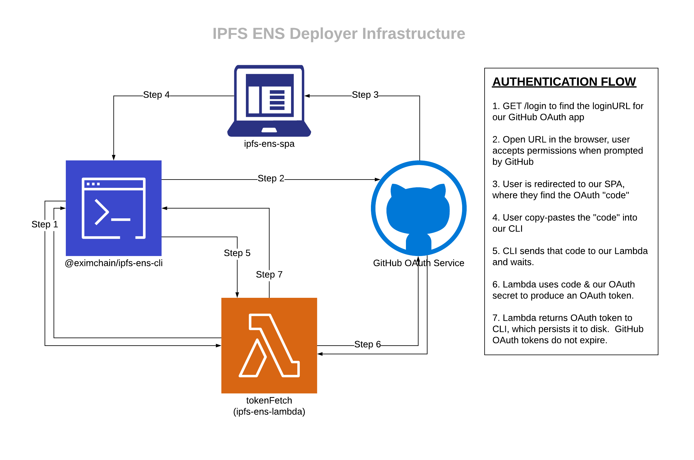
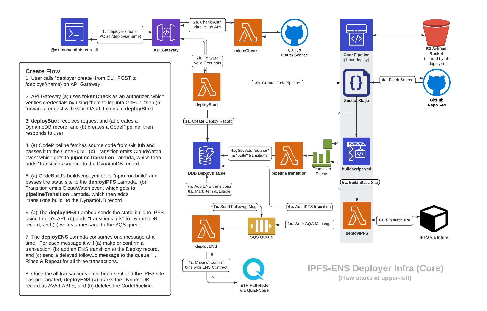

# Project: IPFS-ENS Deployer

**Note: This project was incomplete at the time of writing this. My involvement in this project was primarily at the architectural level, though the diagrams here are not my own.**

A serverless application for deploying a web app to IPFS and hosting it on an ENS Domain
* Allows users to specify a GitHub repository containing a static web app and have it built and deployed to [IPFS](https://ipfs.io/) and hosted at an [ENS](https://ens.domains/) domain
* Uses a completely serverless architecture to allow effortless scaling and cost control
* Integrates with GitHub for authorization as a GitHub OAuth app
* Uses a combination of [AWS CodePipelines](https://aws.amazon.com/codepipeline/) and an [SQS](https://aws.amazon.com/sqs/)-sourced [Lambda](https://aws.amazon.com/lambda/) function to go from client request to deployed and hosted app

## Architecture

[Auth Diagram File](auth-architecture.png)

[Core Diagram File](core-architecture.png)

## Repositories

### Infrastructure

* [Terraform Infrastructure](https://github.com/Lsquared13/terraform-ipfs-ens)

### Typescript Types

* [IPFS-ENS Types](https://github.com/Lsquared13/ipfs-ens-types)
* [API Types](https://github.com/Lsquared13/api-types)

### Clients

* [API Client Library](https://github.com/Lsquared13/ipfs-ens-api-client)
* [React Web App](https://github.com/Lsquared13/ipfs-ens-spa)
* [CLI](https://github.com/Lsquared13/ipfs-ens-cli)

### Lambda Functions

* [All Lambda Functions](https://github.com/Lsquared13/ipfs-ens-lambda)
